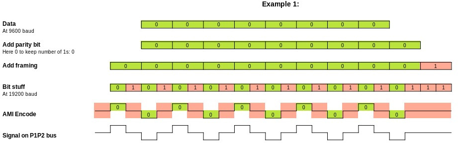
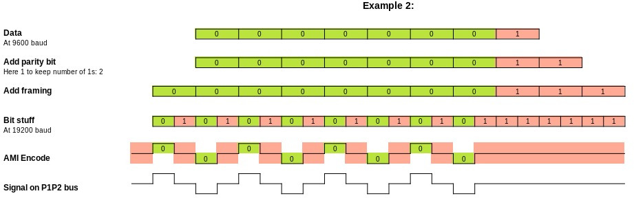
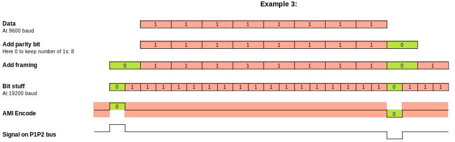
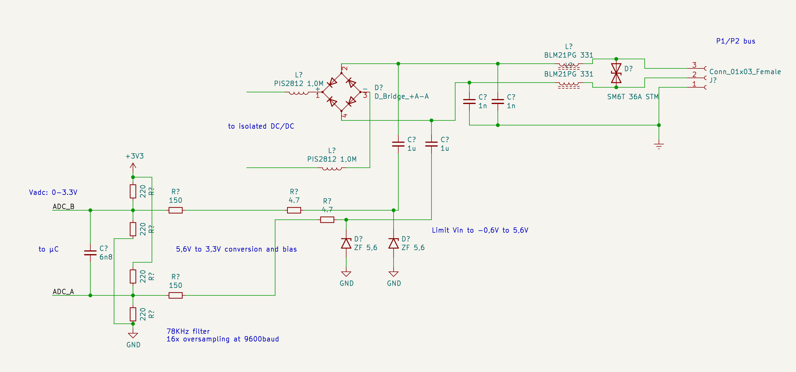
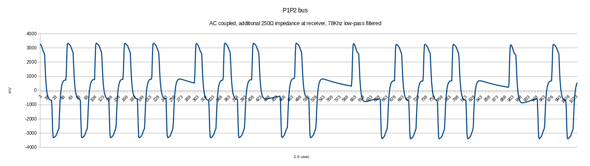

# Daikin P1/P2 bus physical layer

The P1/P2 bus is based on the Japanese the Home Bus System (ET-2101), which is a low speed, half-duplex,
two-wire power line communicaton (PLC) protocol. HBS uses the same physical layer as
[Echonet](https://echonet.jp/wp/wp-content/uploads/pdf/General/Standard/Echonet/Version_2_11_en/spec_v211e_3.pdf).
Some technical details of this standard can be found in chapter 4.

It is a variation of bipolar encoding ([alternate mark inversion](https://en.wikipedia.org/wiki/Bipolar_encoding)), but the pulses only take half of the bit time. So every falling edge in the signal represents a 0, and every "missing" falling edge represents a 1. Every byte is coded as a start bit (0), 8 data bits (LSB first), 1 parity bit (even), and 1 stop bit (1).

### DC component

Daikin uses a 16V DC voltage between the P1 and P2 wires. There is no polarity indicated.

### No inter-byte pauses

The HBS specification is very strict on timing, and does not allow any pauses between bytes that belong together. Indeed the Daikin devices seem to have no pause between the stop bit and the next start bit within a packet, but for example Zennio's KLIC-DA has a short pause in between the individual bytes of a packet - the Daikin seems to accept this.

### Bus collission detection and priority

The HBS standard has an advanced collision detection and priority mechanism. Daikin does not use this - instead, it uses a main controller and a request/response protocol (more on [LogicalFormat](LogicalFormat/README.md)).

## Example data encoding

The following examples show how data is encoded on the P1/P2 bus. The even parity bit,
together with the [AMI](https://en.wikipedia.org/wiki/Bipolar_encoding) encoding ensures
that the data signal is DC free.

The byte 0x00 encoding results in 10 pulses, 5 up and 5 down, resulting in a DC free signal.

The byte 0x80 encoding results in 8 pulses, 4 up and 4 down, resulting in a DC free signal.

The byte 0xff encoding results in 2 pulses, 1 up and 1 down, resulting in a DC free signal.

## Voltage level capture

By using a simple receiver circuit  the
captured Daikin P1/P2 bus looks like this on the microcontroller side (after the DC component is removed):

**Analysis:**
- The transmitter seem to modulate a +/- 3.3V signal onto the bus
- Every packet transmitted has a DC offset of 0.
- Due to the DC blocking capacitor and the load on the line the signal is no
  longer rectangular.
- Due to DC blocking the "idle" level overshoots/undershoots to +- 700mV.
- The overshoot/undershoot need 4 symbols to settle at 0V again.

### Circuit options

A circuit that can read, write, and provide power from the P1/P2 bus can be made with the tiny MAX22088 (TQFN-24 0.5mm pitch). This project's P1P2-ESP-Interface is based on this chip.

The HBS adapter MM1192 can read or write, but not provide bus power. Daikin frequently uses this chip in its conrollers and systems. It can read or write to the bus but it has no support for power from the bus.

The XL1192 is a clone of the MM1192.

Solutions without dedicated chips are available too:
- the reading circuitry above provided by Patrick Rudolph
- [M-NET Sniffer](https://github.com/LenShustek/M-NET-Sniffer))r by Len Shustek (intended for Mitsubishi M-NET) 

### Credits

Thanks to Patrick Rudolph for the images and data encoding explanation above (under CC BY-SA).
