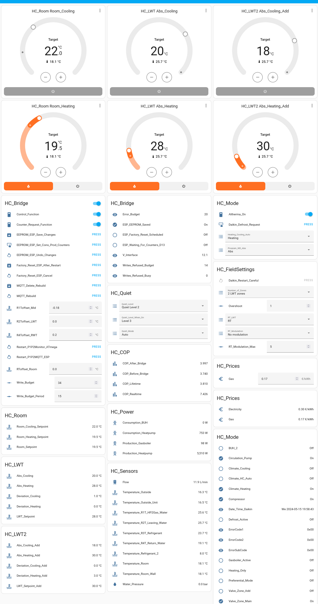
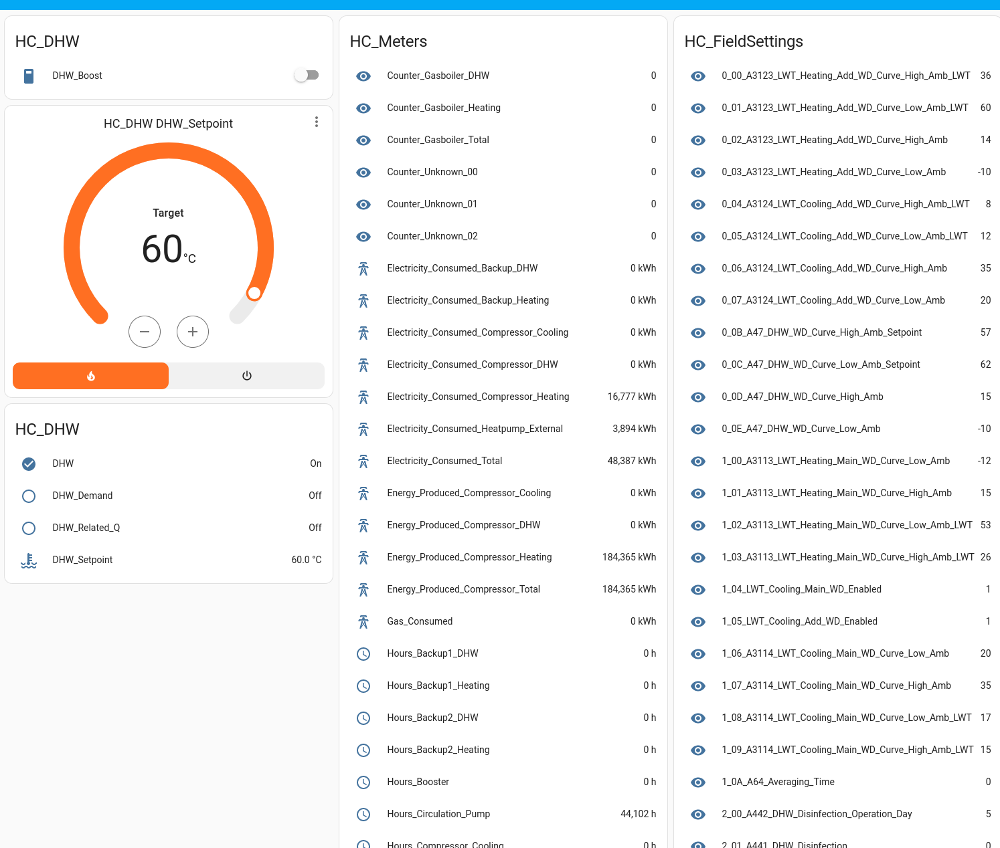
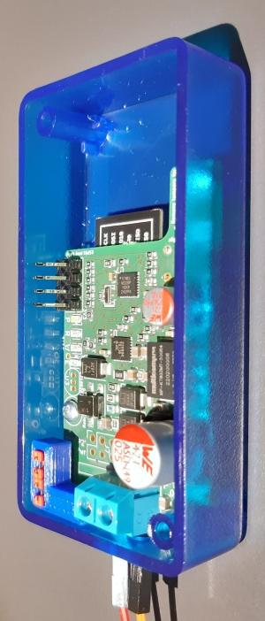
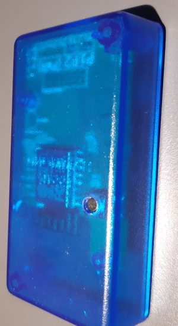

# Control your heat pump from Home Assistant with P1P2MQTT v0.9.46 (previously P1P2Serial)

With release v0.9.46 climate control is automatically configured in Home Assistant. This version comes with a lot of improvements and changes, please see the [v0.9.46 release notes](doc/v0.9.46-releasenotes.md). 

This project primarily supports Daikin systems, but also other brands with HBS-based interfaces (see below).

# Monitor and control your Daikin system from Home Assistant

With the P1P2MQTT project you can monitor and control your heat pump or A/C system - locally - from Home Assistant or via MQTT. Various Daikin systems, especially Altherma full electric and hybrid, Sky Air, and VRV systems, can be monitored and controlled via the P1/P2 2-wire room thermostat interface without any need for a cloud API. Daikin (hybrid) heat pump systems are usually controlled by a room thermostat over a 2-wire HBS interface, called P1/P2, which combines data and power. This project enables to monitor (and, for some systems, control) your Daikin system by connecting to the P1/P2 interface.

Understanding your heat pump system operation is crucial to optimizing comfort, lifetime and reducing your energy bill. We reduced our energy bill by more than 100 Euro per year by monitoring, understanding and then improving our Daikin system settings.

Hopefully this project will reduce your energy consumption/CO2 emission and will increase comfort at your home. You can support this project by sharing your feedback, [buying a P1P2MQTT bridge](mailto:info@home-click.nl?subject=P1P2MQTT%20bridge) from me (please add brand/model/country), [sponsoring](https://github.com/sponsors/Arnold-n) this project or [buying me a coffee](https://www.buymeacoffee.com/arnoldniessen). It helps to bring functionality to other brands and models.

## What do you need ?

- P1P2MQTT bridge to connect to the P1/P2 thermostat interface on your Daikin system
- MQTT server (you can use the built-in MQTT server in Home Assistant)
- Home Assistant (or another MQTT-based solution)

[Instructions to start using Home Assistant.](doc/HomeAssistant.md)

The P1P2MQTT bridge (v1.2) is a stand-alone bus-powered circuit, based on an ESP8266, an ATmega328P, and the MAX22088 HBS adapter. An optional power supply can be connected for systems where the interface cannot provide power. Factory-assembled pre-programmed P1P2MQTT bridges with enclosures are available from me - if you are interested [please mail me for details](mailto:info@home-click.nl?subject=P1P2MQTT%20bridge) and indicate which brand and model system you have, and where you live. Unfortunately I cannot ship everywhere yet.

After connecting the P1P2MQTT bridge to your P1/P2 interface (in parallel to the room thermostat), the bridge will create an AP (default SSID: P1P2, initial password: P1P2P3P4), and you can enter WiFI and MQTT server credentials. The P1P2MQTT bridge will restart and will configure the necessary controls in Home Assistant. The P1P2MQTT bridge
- monitors and (for various models) controls the Daikin heat pump via the P1/P2 bus via MQTT or directly from Home Assistant,
- automatically generates entities and controls in HA via MQTT discovery,
- is OTA upgradable (both ESP and ATmega) (and if that would fail, using an ESP01-programmer via an ESP01-compatible connector),
- is accessible via telnet,
- has 4 LEDS for power (white), reading (green), writing (blue), or to signal an error (red),
- is powered entirely by the P1/P2 bus, no external power supply is needed, has low power consumption (only 31mA at 15V or 0.5W from the P1/P2 bus),
- monitors P1/P2 DC bus voltage,
- has screw terminals for P1 and P2 wires, and
- fits nicely in a small semi-transparant enclosure (80mm x 40mm x 20mm).

For Daikin Altherma systems you can set, via Home Assistant:
- DHW (domestic hot water) on/off
- DHW temperature setting
- heating on/off
- heating/cooling/auto mode
- leaving water temperature setting
- room temperature setting
- quiet mode on/off, and quiet level 1-3 (can be used as power limiter)
- leaving water temperature mode (weather-dependent or absolute, programmed or not)
- request a defrost operation
- restart Daikin system
- change certain field settings (overshoot, max room temperature modulation, overshoot)
- offset on temperature sensors to compensate for measurement errors
- gas price (for hybrid systems)

For some Daikin VRV/Sky Air systems you can set, via Home Assistant:
- heating on/off
- heating/cooling/auto/dry/fan-only mode
- room temperature setting
- fan mode

For other brands and for models that are not (yet) supported, the interface only observes bus traffic and interprets/converts it to Home Assistant entities. Contributions are welcome to make more systems supported!

## Which brands and models are supported?

### Daikin systems

Daikin systems can be identified by their series identifier, which is the first letter of the indoor unit or monoblock unit (E or F, or R for Rotex). It is often E for daikin heat pump systems, R for similar Rotex heat pump systems, and F for VRV/Sky Air systems. Some systems starting with a C are also supported.

The system can be further identified by generation, which is a single letter or two letters after the capacity code, this represents the major version number (A, B, C, CA, CB, D, E, ..).

#### Daikin(/Rotex) E-series

Recent Altherma 3 (full-electric and hybrid) systems are generally supported. Version CA, CB, D, and newer are supported. Older versions AA, AB, AC, and BB can only be monitored and can likely not be controlled. Version AD can perhaps be controlled. Some systems (EWYQ, EKH\*) are very limited and can only be monitored.

Not all Rotex R-series systems have the same capability as their Daikin counterpart.

#### Daikin F-series

Various F-series systems can be monitored and usually also controlled. There are various systems with major version A, B, C, L, LA, M, and P, and PA which are currently supported.

It is logical to assume that devices supported by commercial auxiliary controllers (Daikin LAN adapter, Zennio KLIC-DA KNX interface, Coolmaster, Airzone) could be supported by this project. 

#### Daikin F1/F2 (DIII-Net)

Although electrically supported, no information on the protocol is available yet.

#### Daikin Ech2O

The Altherma 3 R ECH2O models with a E\*P30E\* or E\*P50\*E code use P1/P2 and are supported by the P1P2MQTT bridge.

Other older Altherma 3R ECH2O models with a E\*P50D\* code originate from Rotex and use CANbus to connect to the RoCon+HP controller and are not supported by the P1P2MQTT bridge. These models are perhaps supported by the [pyHPSU project](https://github.com/zanac/pyHPSU).

#### Daikin Fit, Goodman, Amana

Daikin models starting with a D are not supported. These include Daikin Fit models in the USA, originating from Amana and Goodman which were acquired by Daikin. These models do not use P1/P2 as thermostat interface. Perhaps they use RS485, for which [Net485](https://github.com/kpishere/Net485) could be useful.

#### Rotex

Various Rotex models are very similar to Daikin models, often with the initial 'E' replaced by 'R'.

Other Rotex models like the Rotex HPSU Compact series use a CANbus connected controller like the RoConB1, instead of P1/P2. Perhaps these models are supported by the [pyHPSU project](https://github.com/zanac/pyHPSU).

### Hitachi H-link2

Data decoding for a few Hitachi models is available. On one Hitachi system it is possible to monitor of air inlet/outlet, outdoor temperature, gas pipe temperature, compressor temperature and frequency, valve settings, and more.

Please note that the Hitachi H-link2 is also known as H-link, but confusingly H-link is also used for a different serial protocol.

Early experiments are currently done on Hitachi systems with the code in this branch to reverse engineer the protocol. Code to read data from a Hitachi Yutaki S80 Combi heat pump is available [here](https://github.com/hankerspace/HLinkSniffer).

### Mitsubishi Heavy Industries (MHI) X-Y line protocol,

Some limited data decoding is available (temperature, power, swing, fan speed, RC mode).

### Mitsubishi M-net 

Some limited data decoding can be done based on [Len Shustek's protocol observations](https://github.com/LenShustek/M-NET-Sniffer)),

### Toshiba TCC-link

Toshiba TCC-Link (used for indoor-outdoor) is also HBS-based, so monitoring raw hex data should be ossible. However the Toshiba AB-protocol is different (schematics and code [here](https://github.com/issalig/toshiba_air_cond) and [here](https://github.com/burrocargado/toshiba-aircon-mqtt-bridge) and [here](https://burro-hatenablog-com.translate.goog/entry/2022/07/18/230300?_x_tr_sl=auto&_x_tr_tl=en&_x_tr_hl=en&_x_tr_pto=wapp))

### Panasonic/Sanyo SIII-Net, perhaps Haier, York, ..

Monitoring raw hex data may be possible, if the interface is indeed HBS-based.

## Warnings

Any use is entirely at your own risk (CC BY-NC-ND 4.0 Section 5 applies). Take care when using control modes. There is always a risk when you write to the bus based on reverse engineering assumptions. Reading without writing should be safe though. My system has been running continuously in controller mode (monitoring/reading and controlling/writing) for more than 3 years now. Still, use is entirely at your own risk.

- Use the correct firmware images.
- Be aware that the P1/P2 bus provides limited power: do not connnect more than 2 devices, or use a separate power supply for the P1P2MQTT bridge.
- It is advised to connect/disconnect devices to the P1/P2 bus only if the power of all connected devices is switched off.
- On Daikin F-series systems do not change Daikin system settings too often, to avoid non-volatile memory wear. A third-party product manual advises max 7000 setting changes per year for Daikin systems (19/day). As this warning is not given for the Daikin LAN adapter for E-series systems, it is likely that this is not an issue For Daikin E-series systems. Nevertheless the software limites the parameter write frequency to be safe.

## How are the P1P2MQTT bridge software and contributions licensed?

The software is licensed under the CC BY-NC-ND 4.0 (attribution required, non-commercial use only, no derivatives) with exceptions, see [LICENSE.md](https://www.github.com/Arnold-n/P1P2MQTT/blob/main/LICENSE.md). Please comply with the license conditions. If you improve or add, I would be interested to hear from you. Contributions are to be done under the same license, with a waiver of the NC and ND limitations towards the project owner enabling the project owner to build and sell P1P2MQTT bridges).

## About calculating COP and defrost energy losses

In addition to monitoring and control, the P1P2MQTT bridge calculates COP (coefficient of performance) values (*more calculations will follow, for now only real-time COP and lifetime COP are calculated*).

Planned: The long-term average COP value is calculated once per day, week, month, or year. The calculation can be based on
-the energy production counter as hourly reported by the Daikin unit, and as calculated based on delta-T and flow integrated over time
-the energy consumption counter as reported by the Daikin unit (which is only updated once per hour), or better, if available, from an external electricity meter.

Planned: The day-average outside temperature is also calculated for comparison as the COP heavily depends on that temperature. The outside temperature is averaged only over the time the heat pump was switched on.

The current COP value is calculated every second and (planned:) averaged over a predetermined time length and is based on
-the actual energy production as calculated based on the actual delta-T and actual flow
-the energy consumption based on an external electricity meter.

Some newer Daikin hybrid systems do not measure water flow and are thus not able to calculate heating energy produced. This means it is fundamentally impossible to calculate heating power and COP without additional external flow sensor.

## ESPAltherma: alternative approach for Altherma 2/3 using serial connector X10A on Daikin mainboard

[ESPAltherma](https://github.com/raomin/ESPAltherma) is an alternative approach to monitor the Daikin heat pump via the serial connector X10A on the Daikin mainboard in the indoor unit or monoblock of the heat pump. Using only an ESP the heat pump can be monitored over MQTT (using Home Assistant). Using a relay the heat pump can also be switched on and off.

ESPAltherma also reports energy consumption (or actually current and voltage) but the measurements by Daikin are not very accurate, its resolution in my system is 115Watt.

### How does ESPAltherma compare to P1P2MQTT?

Both projects have a lot in common. Some of the monitored parameters of P1P2MQTT are not available via ESPAltherma, and vice versa. P1/P2 is able to report all field settings, energy and hour counters, date and time, and more parameters which ESPAltherma does not all provide, and ESPAltherma reports certain system parameters including primary current, pressure and fan speed which P1/P2 does not provide. The sensor update frequency of P1P2MQTT bridge is higher (once every second instead of twice per minute).

ESPAltherma can control your Daikin system via a relay connected to the main system to switch heating, cooling, and/or smart grid functions on/off. The P1P2MQTT bridge can control these functions via P1/P2, and many more: LWT temperatures, DHW temperature and mode, quiet-mode power limitation, (planned: smart grid), modifying operation modes.

The P1P2MQTT bridge connects directly to the thermostat interface, whereas ESPAltherma connects to the Daikin main system PCB board. As for cost, the hardware for ESPAltherma is cheaper.

## UDP support for Arduino based ESP-less ethernet operation

The [Daikin-P1P2---UDP-Gateway](https://github.com/budulinek/Daikin-P1P2---UDP-Gateway) project is based on an earlier version of this project's hardware and software and provides additional documentation and code to enable direct communication between the P1/P2 heat pump interface and home automation/monitoring systems (such as Loxone) over ethernet/UDP. It enables Loxone to write parameters directly to the P1/P2 bus and set the leaving water temperature remotely.

## What is the HBS or the Daikin P1/P2 and F1/F2 bus?

At the lowest level P1/P2 is a proprietary multi-device time-multiplexed two-wire 9600 baud serial-like bus interface based on the Japanese Home Bus System (ET-2101). Some technical details of this standard can be found in [chapter 4 of the sEchonet specification](https://echonet.jp/wp/wp-content/uploads/pdf/General/Standard/Echonet/Version\_2\_11\_en/spec\_v211e\_3.pdf). F1/F2 is electrically similar to P1/P2 and is used by Daikin to connect indoor units with outdoor units.

The P1/P2 data contains various data items, like temperatures, data flow, software serial number, operating mode, number of operating hours, energy consumed, schedules, field settings, etcetera.

Please refer to the [P1/P2 logical format](doc/LogicalFormat/README.md) and [P1/P2 physical format](doc/PhysicalFormat/README.md) documentation for more details.

### How to interface to P1/P2?

The P1P2MQTT library initially supported only the Arduino Uno (16MHz) and MEGA2560 boards, with a HAT adapter using a [MM1192 HBS transceiver](http://pdf.datasheetcatalog.com/datasheet_pdf/mitsumi-electric/MM1192XD.pdf), and later the XL1192 and the [MAX22088](https://www.analog.com/en/products/max22088.html). The Arduino HAT adapter schematics is still available [here](doc/circuits/Daikin_P1P2_Uno_version2.pdf) but no longer used for this project.

The current P1P2MQTT version only supports the P1P2MQTT bridge combination of MAX22088, ATmega328 and an ESP8266. The MAX22088 is powered directly from the P1/P2 bus. There is no galvanic isolation from the P1/P2 bus, so ensure you do not connect anything else to it. It is a real challenge to solder the fine-pitched MAX22088, that is why I started making P1P2MQTT bridges available.

## How about security?

Anyone with access to your local network can update the firmware of the P1P2MQTT bridge (no password protection yet). Anyone with physical access to the P1P2MQTT bridge reset button, can change WiFi and MQTT credentials via WiFiManager. More [security vulnerabilities](doc/Security.md). If you are aware of any other vulnerabilities, please let me know.

## Acknowledgements

Many thanks to:
- Martin Dell for providing me with an RTD Modbus interface for further testing and for getting another system under control
- Robert Pot for diving into and solving the MQTT disconnect problem and library memory leak
- jarosolanic for adding parameter support for EHVX08S26CA9W and for adding initial MQTT topic output
- a user called "donato35" for discovering that the [P1/P2 bus is using HBS adapters](http://www.grix.it/forum/forum_thread.php?ftpage=2&id_forum=1&id_thread=519140?id_forum=1),
- a user called "Krakra" published a link to a description of the HBS protocol in the [Echonet standard](https://community.openenergymonitor.org/t/hack-my-heat-pump-and-publish-data-onto-emoncms/2551/43) and shared thoughts and code on product-dependent header files,
- Luis Lamich Arocas for providing and analyzing his log files; thanks to his work we could add support for switching DHW on/off and cooling/heating on/off in version 0.9.6 (currently confirmed to work on several EH\* models),
- Bart Ellast for sharing his P1/P2 protocol data and analysis,
- designer2k2 for sharing his EWYQ005ADVP protocol data and analysis,
- Nicholas Roth for testing and making available a MAX22088 schematic and PCB design, and providing his log data
- Paul Stoffregen for publishing the AltSoftSerial library, on which the initial P1P2MQTT library is heavily based
- many others providing feedback, or otherwise supporting this project
