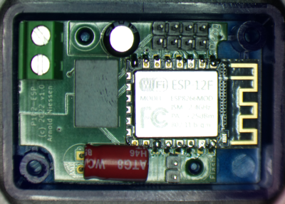

**Monitor and control your Daikin system!**

Daikin (hybrid) heat pump systems are usually controlled by a room thermostat (and/or other controller) over a 2-wire interface, called P1/P2. This project enables to monitor (and, for some systems, control) your Daikin system via the P1/P2 bus, using the P1P2Serial library, some electronics to interface to the P1/P2 wires, an ATmega328, and an ESP8266 or other interface to connect to your network.

It functions as "auxiliary controller" to the main thermostat, requesting the main controller to set certain system paramters on the Daikin system. Depending on your model it may be possible to switch the heat pump or DHW boiler on or off, switch between heating or cooling, set target temperatures, etcetera.

**New design: P1P2-ESP-interface**

Pictured is the new "P1P2-ESP-interface", a complete single-PCB bus-powered P1P2-interface to MQTT over wifi based on the MAX22088 HBS adapter, an ATmega328P, and an ESP8266. No Arduino or power supply is needed any more. This prototype is running succesfully. Connect it to P1/P2, enter your wifi and mqtt credentials via its built-in AP, and the system runs. Functionality:
- monitor and (for some models) control the Daikin heat pump via the P1/P2 bus,
- communicate via MQTT over WiFi,
- OTA upgradable (both ESP and ATmega) (and if that would fail, via a connector),
- powered entirely by the P1/P2 bus, no external power supply is needed, consumes only 30-40mA from the P1/P2 bus,
- 4 LEDS for power (white), reading (green), writing (blue), or to signal an error (red), and
- fits nicely in a small semi-transparant enclosure (50mm x 35mm x 20mm).
With communication over MQTT, integration with grafana, OpenHab, Home Assistant, and many others is possible.

**Old design: P1P2-adapter**

The previous design is the original P1P2-adapter (schema and pictures in https://github.com/Arnold-n/P1P2Serial/tree/master/circuits), a PCB ("HAT") for use on an Arduino Uno. It is based on the MM1192/XL1192 HBS adapter. A newer pin-compatible version based on the MAX22088 is also available (but not yet documented here).

**How can you build or buy one?**

Buy P1P2-ESP-interface: I am accepting pre-orders for the new P1P2-ESP-interface (soldered and pre-programmed), so I know how many I should make. My e-mail address can be found on line 3 of https://github.com/Arnold-n/P1P2Serial/blob/master/P1P2Serial.cpp. At the moment I have only a limited number of the ATmega328P TQFP chips and they are sold out everywhere with long delivery times (1 year!). 

Buy P1P2-adapter: I still sell the original MM1192/XL1192-based 0.5"x2" P1P2-adapter which is a HAT for the Arduino Uno, as well as a newer MAX22088-based P1P2-adapter which is slightly better.

Build P1P2-adapter (MM1192/XL1192): schematics and pictures for the MM1192/XL1192-based P1P2-adapter (for use with the Arduino Uno) are available in https://github.com/Arnold-n/P1P2Serial/tree/master/circuits. The MM1192 is available in traditional DIP format so you can build it on a breadboard. 

Build P1P2-adapter (MAX22088): Alternatively, you may build a circuit based on the newer MAX22088 IC from Maxim. Be warned that it is difficult to solder: it's only available as a 4x4mm 0.5mm pitch TQFN-24 package. The MAX22088 is powered directly from the P1/P2 bus (take care - we don't know how much power Daikin's P1/P2 bus may provide) and is able to power the Arduino Uno (max 70mA at Vcc=5V). PCB and schematic files for a MAX22088-based design are made available by Nicholas Roth at https://github.com/rothn/P1P2Adapter. His design does not provide galvanic isolation from the P1P2 bus, but that is OK if you connect only via WiFi or ethernet.

**What is the P1P2-adapter (old design)?**

The P1P2-adapter circuit is a 0.5" x 2" PCB for the Arduino Uno, and connects to GND, 5V, and to digital pins 8 (RX) and 9 (TX). The schematic is based on the XL1192S IC as shown in circuits/Daikin_P1P2_Uno_version2.pdf. It is a single-sided PCB with SMD components (0805 components, MM1192/XL1192 SOP-16, SI8621 SOIC-8, and a Murata SMD-mounted 5V/5V converter). It provides galvanic isolation to the P1/P2 bus, but it does not support being powered from the P1/P2 bus: you still need a 5V source to power the Arduino Uno, and to power the XL1192 over the DC/DC conveter. Images of the board can be found in the circuits directory.

*Warning: please note that the MM1192/XL1192 circuit may be a burden to the bus if the adapter is not powered (by the Arduino). In that case it is better to disconnect it.*

The newer MAX22088-based adapter is a very similar 0.5"x2" PCB. Instead of the 5V/5V converter, the adapter receives its power from the MAX22088 (thus from the P1/P2 bus). For safety reasons the adapter still has a Si8621 galvanic isolator, and this adapter does not power the Arduino Uno. Because the adapter is bus-powered, it is not a problem if the Arduino is not powered.

**Which Daikin systems are supported?**

There is a large variation in the P1/P2 logical protocol implementation of various Daikin systems. My system is a Daikin hybrid EHYHBX08AAV3 which is supported: many parameters (power consumption, #hours, #compressor-start, temperatures, etc) can be monitored and various system settings can be controlled. Monitoring the P1/P2 bus on other systems should always be possible, but interpretation of the raw data may require further reverse engineering. It is currenly assumed that various Daikin Altherma Hybrid and Daikin Altherma LT models are reasonably similar that they may be supported by changing the parameters used to control certain functions and/or by changing the code which interprets the received data and encodes it into MQTT parameter values.

**No liability, no warranty**

Any use is entirely at your own risk (GPL sections 11 and 12 apply).

**Is it safe?**

There is always a risk when you write to the bus based on reverse engineering and assumptions that unexpected things happen or break. Reading without writing should be safe though. My system has been running continuously in controller mode (writing and reading) for 3 years now. Still, use is entirely at your own risk.

It is advised to connect/disconnect devices to the P1/P2 bus only if the power of all connected devices is switched off. Some Daikin manuals warn that device settings should not be changed too often, because of wear in the solid state memory in their devices - one of their manuals states a maximum of 7000 setting changes per year - without indicating the expected life time of their product. Don't change settings too often.

**Rotex, Hoval, and other Home Bus Systems**

In some countries, Daikin systems are known under the Rotex or Hoval brand name. However, not all Rotex systems use the P1/P2 bus.

This project may also be useful for other Japanese Home Bus System based standards: Echonet, DIII-NET (F1/F2) bus, Mitsubishi M-Net bus, Toshiba TCC-Link, Hitachi H-link, Panasonic/Sanyo SIII-Net, Haier, York, and others.

**Programs in this repo**

The P1P2Monitor program and the P1P2Serial library read and write raw data packets on Daikin P1/P2 two-wire interface, and similar (home bus system/Echonet)  interfaces from other manufacturers, using an Arduino Uno and a P1P2Serial shield. There is preliminary support for some Daikin P1/P2 based devices for parameter interpretation, json, and mqtt.  Preliminary support to switch basic functions (DHW, heating/cooling) on/off is confirmed to work on 3 specific models. 

WiFi can be added using an additional ESP8266 running the P1P2-bridge-esp8266 program. 

Data logged (always useful to log all raw data to check for bus collisions, or an issues) can be analysed using P1P2Convert on any Linux system, enabling further reverse engineering.

**Daikin counters for energy consumption and production**

The Daikin systems keep track of various counters for power consumption, energy production, and number of compressor starts and hours. Unfortunately these counters are not communicated over the bus unless explicitly asked for by the main room controller, which is done only if a user goes into the energy consumption menu. To ensure that these counters can be monitored, an option (COUNTERREPEATINGREQUEST) is implemented in P1P2Monitor to request these counters once per minute.

If you happen to own a KLIC-DA device (a KNX-P1P2 interface), this also reports the Altherma energy counters but does not request counter updates. The P1P2Monitor program can be used to request these counters such that the KLIC-DA device is able to report the actual counters. Be careful though, the request of these counters is a violation of the protocol (the P1P2Monitor program "acts as" main controller which confuses the main controller - in my system this works fine, but carefully check the bus to see how your controller reacts).

**P1P2Serial library and P1P2Monitor example application**

The P1P2Serial library and P1P2Monitor enable reading and writing raw data packets on the Daikin/Rotex P1/P2 serial interface using an Arduino Uno (or a similar board using an ATmega328) and a small P1P2Serial adapter circuit using an MM1192, XL1192, or a MAX22088 IC. This combination translates the P1/P2 signals into a regular serial protocol over USB which can be read by a system such as a Raspberry Pi. The P1P2Monitor program converts bus data from/to ASCII-formatted HEX data. Certain parameters can be adjusted via the serial interface. Each packet (data block of consecutive bytes) starts on a new line. In verbose mode, the time between data blocks is shown in seconds (in ms resolution) at the atart of each line. Also in verbose mode, if an error is detected, a byte is prefixed with "-PE:" in case of a parity error, a byte is postfixed with ":OR-" in case of a read buffer overrun, a byte is prefixed with "-XX:" if a byte read during a write by the monitor itself differs from the byte written (works only if echo mode is on), as it likely signals a collision on the interface. Optionally the last byte of each line, which is usually a CRC byte, is verified for correctness.

Other example programs translate the data packets to parameter format in json and/or mqtt format.

**Home automation, UDP support**

The https://github.com/budulinek/Daikin-P1P2---UDP-Gateway repo provides additional documentation and code to enable direct communication between the P1P2 heat pump interface and home automation/monitoring systems (such as Loxone) over ethernet/UDP. It enables Loxone to write parameters directly to the P1P2 bus and set the leaving water temperature remotely (packet type 0x36). It also includes a very nice summary of the P1P2 protocol and payload description for packet types 0x10 - 0x16 and 0xB8 (for reading data) and 0x35, 0x36 and 0x3A (indicating which parameters can be written: https://github.com/budulinek/Daikin-P1P2---UDP-Gateway/blob/main/Payload-data-write.md).

**ESPAltherma: alternative approach using serial connector X10A on Daikin mainboard**

An alternative approach to monitor the Daikin heat pump uses serial connector X10A on the Daikin mainboard in the heat pump. Using only an ESP the heat pump can be monitored over MQTT (using Home Assistant). Using a relay the heat pump can also be switched on and off. This very interesting project based on reverse engineering the X10A serial protocol is located at https://github.com/raomin/ESPAltherma.

**How does ESPAltherma compare to P1P2Serial?**

Both projects have a lot in common (powered by the system, mqtt/wifi, integration with Home Assistant, ..). In fact they are complementary: some of the monitored parameters of P1P2Serial are not available via ESPAltherma, and vice versa. The major advantages of P1P2Serial are that you can directly connect to the P1/P2 wires, and do not need to touch the Daikin electronics, that it updates data very frequently (every second), and that you can control you Daikin system (subject to the model). ESPAltherma has as major advantages that it requires only a cheap ESP32 circuit (with some simple level shift electronics), and that it supports many different Daikin models.

**Below various set-ups using the P1P2-adapter are provided**

(this section does not apply to the P1P2-ESP-interface, which has everything integrated on a single PCB)

***MQTT or json over WiFi set-up using a P1P2Adapter shield, Arduino Uno and ESP8266***

    P1/P2 (2-wire interface)

|P1P2Adapter Shield (pin 8, 9)|
|-

    (data via pin 8 and pin 9)

|Arduino Uno running P1P2Monitor (with JSON undefined)|
|-

    Serial interface (RX,TX)

|ESP8266 running P1P2-bridge-esp8266
|-

    WiFi

For this set-up, a nice Uno/ESP8266 combi-board used to be available from Robotdyn. Old stock or clone versions can still be found at certain resellers, for example from  https://www.vanallesenmeer.nl/Uno-WiFi-R3-ATmega328-ESP8266-8Mb-USB-TTL-CH340G-Development-Board.

In order to program this board, the following steps are needed:

- enter your mqtt server details in P1P2-bridge-esp8266.ino
- program P1P2Monitor via USB on Arduino ATMega processor (set dip switches 3 and 4 on, others off)
- program P1P2-bridge-esp8266 via USB on ESP8266 (install ESP8266 in Arduino environment, select "Generic ESP8266 Module" as board, select 4MB as available memory) (set dip switches 5, 6, and 7 on, others off)
- connect Atmega and ESP8266 via serial interface: dip switches 1 and 2 on, others off. Optionally, also set dip switch 3 or 5 to on to eavesdrop on the serial communication (in one direction only) via USB
- connect to the ESP WiFi AP on 192.168.4.1
- select your local wifi network, enter password, and have ESP8266 connect to your WiFi
- now, and upon each reboot, the ESP8266 connects to the MQTT server
- the ESP8266 should also become visible in the Arduino IDE as a network port, and can be reprogrammed OTA

***MQTT or json over WiFI set-up using a P1P2-ESP device***

Not yet available, a bus-powered stand-alone P1/P2-WiFI interface is under development.

    P1/P2 (2-wire interface)

|bus-powered P1P2-ESP device
|-

    WiFi

***Raspberry Pi development set-up using a P1P2Adapter shield and Arduino Uno***

    P1/P2 (2-wire interface)

|P1P2Adapter Shield (pin 8, 9)|
|-

    (data via pin 8 and pin 9)

|Arduino Uno running P1P2Monitor (with JSON undefined)|
|-

    Serial over USB

|Raspberry Pi serial terminal program or logger
|-

    WiFi / LAN

This set-up provides flexibity as the Uno can directly be programmed from the Raspberry Pi, and the logged data can be inspected with P1P2Convert.

***json over UDP/LAN set-up using a P1P2Adapter shield, Arduino Mega and W5500***

    P1/P2 (2-wire interface)

|P1P2Adapter Shield|
|-

    (data via pin 48 and pin 46, using a few wires)

|Arduino Mega running P1P2Monitor (with JSON and JSONUDP defined) (*)
|-

    SPI interface

|W5500 ethernet interface
|-

    LAN

(*) Instead of runnning P1P2Monitor in this set-up, the code at https://github.com/budulinek/Daikin-P1P2---UDP-Gateway may better be suited.

**How is the software licensed?**

The software is licensed under GPL V2.0. Please comply with the license conditions. If you improve or add, I would be interested to hear from you.

**Why did you build this?**

My heat pump is a 2014 model Daikin hybrid heat pump/natural gas boiler combination. This is a very efficient combination: a heat pump is used in low power demand situations, whereas in high power demand situations a natural gas after-burner is also used in cascade operation (still allowing the heat pump to operate at low LWT temperature where its efficiency is higher). This reduces natural gas usage by approximately 75% and results in a heat pump achieving, in our case, a year average COP of 3.6. Unfortunately the software in this system is very basic, and it behaves oddly. It often defrosts when totally unneeded, and in other cases not at all when air flow is entirely blocked at the outside unit (the COP will then drop dramatically towards 1.0, the heat pump could detect this situation by internally measuring the COP, but it does not seem to notice at all). It often sets the heat pump at a power setting that leaves the natural gas boiler to operate below its minimum power capability, resulting in an error message on the gas boiler and a far too low LWT, resulting in insufficient heating. Unfortunately, Daikin did not respond to or resolve these complaints. Therefore I want to understand and improve the behaviour myself via the P1/P2 bus.

**What is the Daikin P1/P2 bus?**

Daikin (or Rotex) uses various communication standards between thermostats and heat pumps. The P1/P2 standard is one of them (others are F1/F2, Modbus, BACnet, which are not supported here, even though F1/F2 is electrically the same as P1/P2). The P1/P2 protocol is a proprietary standard. At the lowest level it is a two-wire 9600 baud serial-like interface based on the Japanese Home Bus System (ET-2101). Some technical details of this standard can be found in chapter 4 of the https://echonet.jp/wp/wp-content/uploads/pdf/General/Standard/Echonet/Version_2_11_en/spec_v211e_3.pdf.

**Which interface is supported?**

This project was started for the Daikin P1/P2 bus. However the underlying electrical HBS format is used by many heat pump / air conditioning manufacturers, so far we have indications that the following buses are based on the HBS format: Daikin P1/P2, Daikin F1/F2 (DIII-Net), Mitsubishi M-NET, Toshiba TCC-Link, Hitachi H-link, Panasonic/Sanyo SIII-Net, perhaps also products from Haier and York. The logical format will likely differ. For example, Len Shustek made an impressive OPAMP-based reading circuit for the Mitsubishi M-NET and documented his protocol observations on https://github.com/LenShustek/M-NET-Sniffer. The logical format is clearly different from the Daikin format, but the P1P2Serial library and adapter will likely work for reading and writing M-NET too as the physical format is the same or similar. For Hitachi H-link, code to read data from a Hitachi Yutaki S80 Combi heat pump is available on https://github.com/hankerspace/HLinkSniffer.

**More details on the P1P2-adapter circuit**

This project strated with a separate adapter for the P1/P2 bus using an Arduino Uno (or other ATmega board) together with a HBS transceiver such as the MM1192/XL1192 HBS-Compatible Driver and Receiver (http://pdf.datasheetcatalog.com/datasheet_pdf/mitsumi-electric/MM1192XD.pdf) or the MAX22088/MAX22288 (https://www.maximintegrated.com/en/products/interface/transceivers/MAX22088.html or https://www.maximintegrated.com/en/products/interface/transceivers/MAX22288.html). The P1P2Serial library only supports some ATmega boards; it was tested on Arduino Uno and Arduino Mega2560. The library itself does not run on ESP devices as it requires the "timer input capture mode" of the ATmega to read and write the low-level signals.

The preferred circuit schematics (version 2) has galvanic isolation and an isolated DC-DC converter to power the MM1192/XL1192. A MAX22088 alternative is available, with galvanic isolation, without the DC-DC converter.

The MM1192 data sheet does not provide information how to build a working circuit, but the data sheet for the MM1007 (https://www.digchip.com/datasheets/parts/datasheet/304/MM1007.php) and the XL1192 (http://www.xlsemi.com/datasheet/XL1192%20datasheet-English.pdf) show how to build it. Unfortunately, these schematics did not work for me as the MM1192 detected a lot of spurious edges in the noisy P1/P2 signal. This was due to the relatively high amplitude of signal and noise, and to the common-mode distortion of the signal in the initial version without galvanic isolation (likely due to capacitive leakage in the USB power supply for the Arduino). I had to make two modifications to resolve that: (1) both resistors between the MM1192 and the P1/P2 lines were changed from 33kOhm to 150kOhm; and (2) one 1.5 kOhm resistor was added between ground and P1, and one 1.5 kOhm resistor was added between ground and P2. A further modification, the addition of a 470pF capacitor between pin 15 and pin 16 of the MM1192, reduces the detection of spurious edges further. Line termination (a 10uF capacitor and a 100-200Ohm resistor in series between P1 and P2) may also improve the quality of the incoming signal. 

XLSemi produces the XL1192 which looks like a direct clone of the MM1192. The XL1192 data sheet suggests that the specifications are the same, but they are not. The XL1192 has a higher voltage threshold on its input and a slightly lower (20% lower) voltage swing on its output channel. Using 75kOhm resistors instead of 150kOhm resistors on the input side of the XL1192 works perfect in my situation.

If you want to power the bus (which is only needed if you want to communicate to a stand-alone controller which is disconnected from and thus not powered from the heat pump) you can do so by providing 15V to the bus over a 20mH inductor with a reasonably low internal resistance (for example 2 RLB1314-103KL 100mH/12ohm/100mA inductors in series), or by using the MAX22088 which supports bus-powered operation (see below for a link to MAX22088 schematics).

Alternatively, you may build a circuit based on the newer MAX22088 IC from Maxim. The MAX22088 is powered directly from the P1/P2 bus (take care - we don't know how much power the bus may provide) and is able to power the Arduino Uno (max 70mA at Vcc=5V). PCB and schematic files for a MAX22088-based design are made available by Nicholas Roth at https://github.com/rothn/P1P2Adapter. This design does not provide galvanic isolation from the P1P2 bus, but that is OK if you connect only via WiFi or ethernet.

The read part of the circuit can also be built using a few opamps as demonstrated by https://github.com/LenShustek/M-NET-Sniffer.

**Where can I buy a MM1192 or XL1192 or MAX22x88?**

The MM1192 (DIP or SOIC) and XL1192S (SOIC) are available only from a few sellers on ebay and aliexpress. The XL1192S can also be purchased from https://lcsc.com.

The MAX22088 and MAX22288 are available from regular distributors such as Mouser, Digikey, Farnell, and RS.

**What does the data on the P1/P2 bus look like, at the physical level?**

The P1/P2 bus uses the Home Bus System protocol, which is a serial protocol. It is a variation of bipolar encoding (alternate mark inversion, https://en.wikipedia.org/wiki/Bipolar_encoding), but the pulses only take half of the bit time. So every falling edge in the signal represents a 0, and every "missing" falling edge represents a 1. Every byte is coded as a start bit (0), 8 data bits (LSB first), 1 parity bit (even), and 1 stop bit (1). The Daikin devices have no pause between the stop bit and the next start bit, but Zennio's KLIC-DA has a short pause in between the individual bytes of a packet. Oscilloscope pictures are available on http://www.grix.it/forum/forum_thread.php?ftpage=2&id_forum=1&id_thread=519140. As it is a two-wire interface, devices should not write on the bus if any other device is writing. The HBS standard has an advanced collision detection and priority mechanism. In a 2-device set up of a Daikin heat pump and a thermostat, the devices seem to simply alternate turns in writing to the bus, and Daikin does not seem to support bus usage detection and collission avoidance, so take care when writing to the bus to avoid bus collisions.

**What does the data on the P1/P2 bus look like, at the logical level?**

The Daikin protocol does not follow the HBS packet format or HBS timing specification. Instead, the data is transmitted in short packets of 4-24 bytes each. Each cycle has a number of request packets sent by the thermostat and answered by the heat pump; additionally, a number of request packets are sent by the thermostat and answered by an external auxiliary controller (if available); some systems support only one auxiliary controller, others support two. The Daikin hybrid system uses a protocol where a set of 13, sometimes more, packets are communicated in sequence. We will call this set of packets a package. The thermostat sends the first packet and the last packet in each package. Further exceptions apply. The first few bytes of each packet may indicate source, desination, and/or packet type number. After that the payload follows, followed by a CRC byte. The CRC algorithm for the Daikin hybrid is a simple 8-bit LFSR with a feed of 0x00 and a generator value of 0xD9. It may be different for other products.

**What does the payload look like?**

The payload contains various data items, like temperatures, data flow, software serial number, operating mode, number of operating hours, energy consumed, etcetera. Temperatures and flows can be coded as value\*10, so with an accuracy of one digit after the comma: a value of 0x01B6 (hex value for 438, means 43.8). Other values may be encoded as two bytes, one byte for the value before the comma, the other behind (for example a room temperature is encoded as 0x14 0x18, or 20 24, meaning 20 24/256 or 20.1 degrees).

**How to avoid bus collissions when writing?**

The simple answer is: write when others don't. In practice communication seems to be initiated by the thermostat(s), and parties alternate turns. The heat pump seems to answer each request after a fixed time (25ms in my situation). P1P2Serial implements a setDelay(t) function which ensures a write does not happen until exactly t milliseconds after the last start bit falling edge detected. Calling setDelay(2) before starting a (block)transmission is a safe way to start any block of communication. If imitating a heat pump, calling setDelay(25) would make the adapter answer 25ms after the last byte received. Use of setDelay(1) is discouraged: a byte transmission takes slightly longer than 1 ms. A setDelay(1) will set transmission to 1.146ms, the time it takes to transmit 1 byte (11 bits at 9600 baud), but this still creates a bus collision if the other party transmitting has not finished. This may be detected by a parity error or read-back verification error. Some simple bus collision avoidance mechanism is implemented but bus collissions are of course better avoided.

**Which files are included?**

- LICENSE: GPL-v2.0 license for P1P2Serial library and the P1P2\* example programs,
- ReleaseNotes.md,
- SerialProtocol.md, describes serial protocol used by P1P2Monitor and P1P2-bridge-esp8266
- MqttProtocol.md, describes mqtt channels used by P1P2-bridge-esp8266
- P1P2Serial.cpp and P1P2Serial.h: (GPL-licensed) P1P2Serial library, based on AltSoftSerial (uses AltSoftSerial configuration files),
- examples/P1P2Monitor: (GPL-licensed) monitor program on Arduino, uses P1P2Serial library. Shows data on P1/P2 bus on serial output, and enables writing data from serial input. Reading/writing packets of data and CRC-byte generation/verification is supported. This program has no LCD support as of version 0.9.4, json/udp support (output via serial or udp) has been added as of version 0.9.6,
- examples/P1P2-bridge-esp8266: (GPL-licensed) program to convert P1P2Monitor's serial output to mqtt and json format, and preliminary support to write packets to the P1P2 bus from a mqtt channel,
- examples/P1P2Convert: (GPL-licensed) host-based (Linux Ubuntu / Raspberry Pi) program to (post-)process P1P2Monitor's serial output (directly from USB or from recorded logs), outputs parameters to stdout, making reverse-engineering protocol data easier,
- examples/P1P2HardwareTest: (GPL-licensed) program to stand P1P2Serial adapter shield in stand-alone mode,
- examples/P1P2LCD: (GPL-licensed) program to show P1P2 data on a an additional SPI 128x64 display connected directly to the Arduino Uno pins. This works for the Daikin hybrid model, it may work (partially) for other models. This program requires that the u8g2 library is installed,
- Daikin specific but product independent header file P1P2_Daikin_json.h supporting conversion to json format (this is included by the product-dependent header file(s)),
- Daikin specific but product dependent header file P1P2_Daikin_json_EHYHB.h supporting conversion to json format, this file is included by the P1P2json example program,
- doc/README.md and doc/Daikin-protocol\*: generic and product-dependent observations of protocol data for various heat pumps (work-in-progress, contributions welcome),
- circuits/\*: P1/P2 adapter schematic and pictures of adapter board,
- examples/P1P2Monitor/usb2console.py: simple python program to copy USB serial output from Arduino to stdout on a Raspberry Pi or other host (for logging and/or processing by P1P2-bridge-ubuntu),
- config/AltSoftSerial_Boards.h and AltSoftSerial_Timers.h: (MIT-licensed) AltSoftSerial configuration files, copied without modification from the AltSoftserial project,
- notebooks/Good Data Analysis.ipynb: Jupyter notebook file containing log data from Nicholas Roth's system, and
- README.md: this file.

**Acknowledgements**

Many thanks to the following persons:
- jarosolanic for adding parameter support for EHVX08S26CA9W and for adding MQTT topic output in P1P2Monitor
- a user called "donato35" for discovering that the P1/P2 bus is using HBS adapters (http://www.grix.it/forum/forum_thread.php?ftpage=2&id_forum=1&id_thread=519140?id_forum=1),
- a user called "Krakra" published a link to a description of the HBS protocol in the Echonet standard (https://community.openenergymonitor.org/t/hack-my-heat-pump-and-publish-data-onto-emoncms/2551/43) and shared thoughts and code on product-dependent header files,
- Luis Lamich Arocas for providing and analyzing his log files; thanks to his work v0.9.6 version we could add support for switching DHW on/off and cooling/heating on/off (currently only confirmed to work on EHVX08S23D6V and EHYHBX08AAV3),
- Bart Ellast for sharing his P1/P2 protocol data and analysis,
- designer2k2 for sharing his EWYQ005ADVP protocol data and analysis, and
- Nicholas Roth for testing and making available a MAX22088 schematic and PCB design, and providing his log data
- Paul Stoffregen for publishing the AltSoftSerial library, on which the P1P2Serial library is heavily based.
