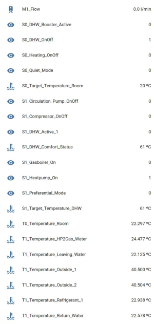
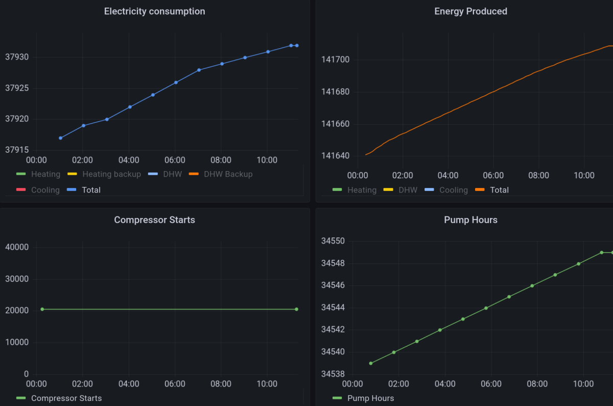
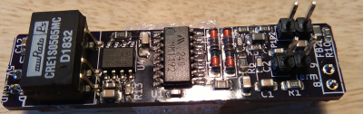

**Monitor and control your Daikin system via the room controller (P1/P2) interface!**

Daikin (hybrid) heat pump systems are usually controlled by a room thermostat (and/or other controller) over a 2-wire interface, called P1/P2. This project enables to monitor (and, for some systems, control) your Daikin system from e.g. Home Assistant over MQTT via the P1/P2 thermostat wires, using the hard- and software of this project. For monitoring it is only eavesdropping on the regular communication between the main controller and the heat pump. For some models it provides control by acting as an "auxiliary controller" to the main thermostat, requesting the main controller to set certain system parameters on the Daikin system. Depending on your model it may be possible to switch the heat pump or DHW boiler on or off, switch between heating or cooling, set target temperatures, etcetera.

If this project is useful for you, or valuable (I hope it reduces your energy bills and CO2 emissions), please consider to [buy me a coffee](https://www.buymeacoffee.com/arnoldniessen) or sponsor this project or share your experiences and log files. It motivates me to extend its functionality to other models.

**New design: P1P2-ESP-interface**

Pictured is the new "P1P2-ESP-interface", a complete single-PCB bus-powered wireless P1P2-MQTT bridge. It is based on an ESP8266 (running P1P2-ESP-MQTT), an ATmega328P (running P1P2Monitor), and the MAX22088 HBS adapter (mounted on the lower side of the PCB). No Arduino or power supply is needed any more. Power is supplied by a DC/DC converter to minimize bus load (30-40mA at 15V). Connect it to P1/P2 near your main controller or near your Daikin system, enter your wifi and mqtt credentials via its built-in AP, and the system runs. Functionality:
- monitor and (for some models) control the Daikin heat pump via the P1/P2 bus from Home Assistant (automatic configuration, using MQTT discovery),
- communicate via MQTT over WiFi,
- accessible via telnet,
- OTA upgradable (both ESP and ATmega) (and if that would fail, using an ESP01-programmer via an ESP01-compatible connector),
- powered entirely by the P1/P2 bus, no external power supply is needed, low power consumption (30-40mA/0.5W from the P1/P2 bus) thanks to a DC/DC converter,
- 4 LEDS for power (white), reading (green), writing (blue), or to signal an error (red),
- screw terminals for P1 and P2 wires, and
- fits nicely in a small semi-transparant enclosure (50mm x 35mm x 20mm).

With communication over MQTT, integration with Home Assistand will be automatic, and interfacing to other systems (grafana, OpenHab, EmonCMS) should not be too much work.

By default, the interface only observes and attempts to interpret bus traffic. For some models, it may also act as auxiliary controller and control parameter settings over MQTT.

**How can you build or buy one?**

Buy new complete stand-alone P1P2-ESP-interface): I made a small number of factory-assembled PCBs (with ATmega328P and ESP12F, bus-powered, with enclosure, soldered, pre-programmed, documented and tested), (August 2022:) these are all sold or reserved. I plan to make more. Please let me know if you are interested: my e-mail address can be found on line 3 of [P1P2Serial.cpp](https://github.com/Arnold-n/P1P2Serial/blob/main/P1P2Serial.cpp).

Buy P1P2-adapter (older design below): I also sell the original MM1192/XL1192-based 0.5"x2" P1P2-adapter which is a HAT for the Arduino Uno, as well as a newer MAX22088-based P1P2-adapter HAT which is slightly better.

Build P1P2-adapter (MM1192/XL1192): schematics and pictures for the MM1192/XL1192-based P1P2-adapter (for use with the Arduino Uno) are [here](https://github.com/Arnold-n/P1P2Serial/tree/main/circuits). The MM1192 is available in traditional DIP format so you can build it on a breadboard. 

Build P1P2-adapter (MAX22088): Alternatively, you may build a circuit based on the newer MAX22088 IC from Maxim. Be warned that it is difficult to solder: it's only available as a 4x4mm 0.5mm pitch TQFN-24 package. The MAX22088 is powered directly from the P1/P2 bus (take care - we don't know how much power Daikin's P1/P2 bus may provide, perhaps max 60mA) and is able to power the Arduino Uno (max 70mA at Vcc=5V). PCB and schematic files for a [MAX22088-based design](https://github.com/rothn/P1P2Adapter) are made available by Nicholas Roth. His design does not provide galvanic isolation from the P1P2 bus, but that is OK if you connect only via WiFi or ethernet.

**Older design: P1P2-adapter**

The previous design is the P1P2-adapter this project started with (schema and pictures in https://github.com/Arnold-n/P1P2Serial/tree/main/circuits), a PCB ("HAT") for use on an Arduino Uno. It is based on the MM1192/XL1192 HBS adapter chip. A newer pin-compatible HAT based on the MAX22088 is also available (but not yet documented here).

It is a 0.5" x 2" PCB for the Arduino Uno, and connects to Arduino Uno's GND, 5V, and to digital pins 8 (RX) and 9 (TX). The schematic is based on the XL1192S IC as shown in circuits/Daikin_P1P2_Uno_version2.pdf. It is a single-sided PCB with SMD components (0805 components, MM1192/XL1192 SOP-16, SI8621 SOIC-8, and a Murata SMD-mounted 5V/5V converter). It provides galvanic isolation to the P1/P2 bus, but it does not support being powered from the P1/P2 bus: you still need a 5V source to power the Arduino Uno, and to power the XL1192 over the DC/DC conveter. Images of the board can be found in the circuits directory.

A variant of this board is based on the newer MAX22088 adapter. It is a very similar 0.5"x2" PCB for the Arduino Uno. Instead of the 5V/5V converter, the adapter receives its power from the MAX22088 (thus from the P1/P2 bus). For safety reasons the adapter still has a Si8621 galvanic isolator, and this adapter does not power the Arduino Uno.

*Warning: please note that the XL1192-based circuit may be a burden to the bus if the adapter is not powered (by the Arduino). If unpowered, it is better to disconnect it. This warning does not apply to MAX22088 based circuits.* 

**New software, new name: P1P2MQTT**

The program P1P2-bridge-esp8266 wil be revised and will be called P1P2MQTT as it describes its function better: to bridge between P1/P2 2-wire interface and MQTT. The program to run on the ATmega will remain P1P2Monitor. Both are running on the P1P2-ESP-interface hardware.

This project started as a low-level reverse engineering project, and was inspired by AltSoftSerial, hence the name P1P2Serial. This name no longer covers the scope from P1/P2 to MQTT. The project may also be renamed to P1P2MQTT.

**Which Daikin systems are supported?**

There is a large variation in the P1/P2 logical protocol implementation of various Daikin systems. My system is a Daikin hybrid EHYHBX08AAV3 which is supported: many parameters (power consumption, #hours, #compressor-start, temperatures, etc) can be monitored and various system settings can be controlled. Monitoring the P1/P2 bus on other systems should always be possible, but interpretation of the raw data may require further reverse engineering. It is currently assumed that various Daikin Altherma Hybrid and Daikin Altherma LT models are reasonably similar that they may be supported by changing the parameters used to control certain functions and/or by changing the code which interprets the received data and encodes it into MQTT parameter values.

As we have no access to Daikin's documentation, we do not know which systems are supported. Various users have reported success in basic control functions. In my hybrid system I can control almost all parameters. It is logical to assume that devices supported by commercial auxiliary controllers (Daikin LAN adapter, Zennio KLIC-DA KNX interface, Coolmaster) could be supported by this project.

We have very limited experience with VRV-based systems (systems with multiple indoor ceiling units), of which model numbers start with an "F". These models also use the P1/P2 bus to the controller, with a similar protocol for basic communication, but we don't know how the auxiliary controller communication goes. It should be possible to at least monitor the packets on the bus. If someone figures out how the auxiliary controller protocol works for these systems, it should be possible to set the unit on/off, set operating mode, fan speed level and swing function, and temperature setoint.

**COP calculation, defrost energy losses**

In addition to monitoring and control, the P1P2-ESP-interface also calculates the COP (coefficient of performance) values (*this function will be released in the future*).

Both long-term and actual COP values are calculated.

The long-term average COP value is calculated once per day, week, month, or year. The calculation can be based on
-the energy production counter as hourly reported by the Daikin unit, and as calculated based on delta-T and flow integrated over time
-the energy consumption counter as reported by the Daikin unit (which is only updated once per hour), or better, if available, from an external electricity meter.

The day-average outside temperature is also calculated for comparison as the COP heavily depends on that temperature. The outside temperature is averaged only over the time the heat pump was switched on.

The current COP value is calculated every second and averaged over a predetermined time length and is based on
-the actual energy production as calculated based on the actual delta-T and actual flow
-the energy consumption based on an external electricity meter.

ESPAltherma also reports energy consumption (or actually current and voltage) but the readings from my Daikin system are not very accurate, its resolution in my system is 115Watt.

**No liability, no warranty**

Any use is entirely at your own risk (CC BY-NC-ND 4.0 Section 5 applies, for earlier versions GPL sections 11 and 12 apply).

**Is it safe?**

There is always a risk when you write to the bus based on reverse engineering and assumptions that unexpected things happen or break. Reading without writing should be safe though. My system has been running continuously in controller mode (writing and reading) for 3 years now. Still, use is entirely at your own risk.

It is advised to connect/disconnect devices to the P1/P2 bus only if the power of all connected devices is switched off. Some Daikin manuals warn that device settings should not be changed too often, because of wear in the solid state memory in their devices - one of their manuals states a maximum of 7000 setting changes per year - without indicating the expected life time of their product. Don't change settings too often.

**How to get started / and is my system supported?**

If your system has a P1/P2 connection to the main controller or room thermostat, you will almost certainly be able to monitor raw data from the P1/P2 bus. P1P2Monitor and P1P2MQTT/P1P2-bridge-esp8266 will try to interpret the data, reported as parameters. This may be more or less succesful, hopefully the interpreted data makes sense. If not, you may look at the raw data patterns, and try to understand these and compare these with the examples in the doc folder.

If, like many systems, your system communicates with a repeating pattern of packages made of request/response pairs of packet types 10-15/16, followed by a single request packet with header 00F030<payload with mostly 00s and some low nrs>, you may be lucky. If the 00F030 request is followed by a longer pause (100-200ms), and no answer 40F030<payload>, the P1P2Monitor might function as an auxiliary controller responding to that request. If you switch P1P2Monitor controller functionality on (by sending "\*" followed by "l1" to MQTT channel P1P2/W/\<xxx\>), it will start replying to each 00F030 packet with a 40F030<payload> response after which more 00F03x/40F04x packets are exchanged. These packets are likely similar to but different than the example system. Parameters for switching certain functions on/off may depend on the model and do depend on which control mode the system is operating in. It is useful to monitor the system for a while in this mode, and important to first check that there are no read errors or bus collissions.

When an auxiliary controller starts to be active, the main controller will regularly communicate all parameters to the auxiliary controller. To communicate all parameters takes a few minutes. In addition, any parameter changed on the main controller will almost immediately be communicated. By default, P1P2-ESP filters any parameter of which the value has not changed. After a few minutes its output will get mostly silent. If the time (minute and perhaps second) is part of the data, you will see time progress. You will likely see some reports when temperature measurements vary. And if everything works well you should see any manual changes made on the main controller be reported. It is useful to record which parameters are 

If you start monitoring and you find that there is already an answer 40F030<payload> in your system, this may be due to a Daikin LAN module or other auxiliary controller in your system. It may even be part of your main Daikin system itself. In that case it is useful to check if the main controller makes a packet type 40F130<payload with mostly 00s and some lower numbers> (so F1 instead of F0). This means the main controller is ready to interface to a second auxiliary controller. If you switch P1P2Monitor's control functionality on, it will detect that there is already a first active auxiliary controller in your system, it will check whether a second auxiliary controller is supported by your main controller, and if so, it will act as second auxiliary controller.

The parameters sent by the main controller are useful to monitor. After each main package and 00F030/40F030 exchange additional 00F03x/40F04x packets will exchange many system parameters. These are likely similar to but different than the example system. Parameters for switching certain functions on/off may depend on the model and also depend on which control mode the system is operating in. It is useful to monitor the system for a while, make a few simple manual changes on the main controller (such as temperature deviation if you are using weather-dependent mode with deviation), to get comfortable with the communication patterns. This will cause the main controller to communicate the parameter changes to the auxiliary controller. If the reported parameter changes match the documentation here, you may try to set certain parameters and check if the main controller's settings are being updated.

Until this point, P1P2Monitor only acted as an auxiliary controller, receiving parameters, and sending trivial acknowledgements, but P1P2Monitor did not do any control. Control requires explicitly asking P1P2Monitor to set a certain parameter. In the current version (0.9.13), you may try to switch heating off by sending "Z0" to MQTT channel P1P2/W/\<xxx\>. We found that the parameter used for switching heating on/off is 0x2D, 0x2F, or 0x3, depending on your model and/or your operaing mode (room temperature or weather-dependent). You can switch heating on by command "Z1" and switch heating off by sending "Z0". If you would like to change another parameter, just enter "P31"  before "Z1" and paramter 0x31 will be set to 0x01. The default parameter for the "Z" write operation is set in P1P2Config.h of P1P2Monitor.

A new generic write command 'E XX YY ZZ' will write parameter number YY in packet type XX to value ZZ. Packet type is typically 0x35-0x3D, a parameter number is a low 16-bit value, and ZZ is a 1, 2, 3, or 4 byte value depending on the packet (value for packet type 0x35 and 0x3A is 1-byte, for 0x36 and 0x3B 2-byte, for 0x37 and 0x3C 3-byte, and for 0x38, 03x9 and 0x3D 4-byte).

It would be great if you could share your experiences, contribute code or logs, either here on Github or by e-mailing me so we can document which models are supported and add support for more models.

WARNING: do not change parameter settings too frequently. Daikin warns not to use more than 7000 setting changes/year (likely based on 100.000 writes to flash memory and 14 year expected lifetime). This means for example that you should not control the heat pump by setting the target temperature frequently based on measurements. In the next release, P1P2Monitor will throttle setting changes to a maximum of 1 parameter write per 2 hours (with an initial budget of 10 writes upon every restart of P1P2Monitor). These parameters can be changed only in the configuration header files. If you run out of write budget while experimenting, you may reset the write budget by resetting the ATmega.

**Daikin counters for energy consumption and production**

The Daikin systems keep track of various counters for power consumption, energy production, and number of compressor starts and hours. Unfortunately these counters are not communicated over the bus unless explicitly asked for by the main room controller, which is done only if a user goes into the energy consumption menu. To ensure that these counters can be monitored, an option (COUNTERREPEATINGREQUEST) is implemented in P1P2Monitor to request these counters once per minute. This request is inserted in the pause between blocks, where the auxiliary controller is supposed to respond to the 00F030 request. Instead, we "steal the bus", shortly play main controller and transmit one 0000B8 request directly which is then answered by the heat pump. My main controller is slightly confused and immediately starts a new block (with a 000010 packat) to show it is supposed to be the main controller.

If you happen to own a KLIC-DA device (a KNX-P1P2 interface), this also reports the Altherma energy counters but does not request counter updates. The P1P2Monitor program can be used to request these counters such that the KLIC-DA device is able to report the actual counters. If KLICDA is #defined in P1P2Config.h, this request is done in between the 400012 and 000013 message, which doesn't give a bus collission on my system if timed properly (see explanation in P1P2Config.h). Again: the request of these counters is a violation of the protocol (the P1P2Monitor program "acts as" main controller which confuses the main controller - in my system this works fine, so carefully check the bus operation and any error messages to see how your controller reacts if you use this option).

**ESPAltherma: alternative approach using serial connector X10A on Daikin mainboard**

An alternative approach to monitor the Daikin heat pump uses serial connector X10A on the Daikin mainboard in the heat pump. Using only an ESP the heat pump can be monitored over MQTT (using Home Assistant). Using a relay the heat pump can also be switched on and off. This very interesting project based on reverse engineering the X10A serial protocol is located at https://github.com/raomin/ESPAltherma.

**How does ESPAltherma compare to P1P2Serial?**

Both projects have a lot in common (powered by the system, mqtt/wifi, integration with Home Assistant, ..). In fact they are complementary: some of the monitored parameters of P1P2Serial are not available via ESPAltherma, and vice versa. P1/P2 is able to report all field settings, many parameters, energy and hour counters, and date and time, which ESPAltherma does not all support, and ESPAltherma reports certain system parameters including primary current, pressure and fan speed which P1/P2 does not support. The major advantages of P1P2Serial are that you can directly connect to the P1/P2 wires, and do not need to touch the internal Daikin electronics of the main system, that it updates data much more very frequently (every second), and that you can control you Daikin system (subject to the model). ESPAltherma has as major advantages that it requires only a cheap ESP32 circuit, and that it supports many different Daikin models.

ESPAltherma can control your Daikin system via a relais connected to the main system to switch heating, cooling, and/or smart grid functions on/off. P1P2serial can (if your system is supported) via MQTT control many system parameters by acting as an auxiliary controller and thus switch DHW, heating and cooling on/off, set target temperatures, and much more.

**New P1P2Serial library**

As of version 0.9.14, the P1P2Serial library interrupt handling has been rewritten entirely, to ensure that interrupt handling is done as predictable and quickly as possible. This enables the ATmega328 to run at 8 MHz (instead of 16MHz on Arduino Uno), reducing its power consumption, and enabling operation at 3.3V instead of 5V.

For 16MHz operation (Arduino Uno) it is recommneded to use the old library by defining #OLDP1P2LIB, which is done automaticallyh in P1P2_Config.h. 

Please let me know if you encounter any issues with the new library.

To compile for 8Mhz, you may need to install MCUdude's MiniCore hardware package and then select ATmega328 and the correct frequency, and set the fuses accordingly for the lower speed.

**Which other HBS interfaces are supported?**

This project was started for the Daikin P1/P2 bus. However the underlying electrical Japanese Home Bus System is used by many heat pump / air conditioning manufacturers. We have indications that, in addition to Daikin's P1/P2, the following buses are also based on the HBS format:
- Daikin F1/F2 (DIII-Net), 
- Mitsubishi M-NET (Len Shustek made an OPAMP-based reading circuit and documented his [protocol observations](https://github.com/LenShustek/M-NET-Sniffer)),
- Toshiba TCC-Link (used for indoor-outdoor, but not for the indoor-indoor and indoor-thermostaat AB-protocol (schematics and code [here](https://github.com/issalig/toshiba_air_cond) and [here](https://github.com/burrocargado/toshiba-aircon-mqtt-bridge) and [here](https://burro-hatenablog-com.translate.goog/entry/2022/07/18/230300?_x_tr_sl=auto&_x_tr_tl=en&_x_tr_hl=en&_x_tr_pto=wapp)),
- Hitachi H-link (code to read data from a Hitachi Yutaki S80 Combi heat pump is available [here](https://github.com/hankerspace/HLinkSniffer)).
- Panasonic/Sanyo SIII-Net, and
- perhaps also products from Haier and York.

At least raw data should be observable using the electronics and P1P2Monitor from this project, but the logical format will of course be different.

**Rotex, Hoval**

In some countries, Daikin systems are known under the Rotex or Hoval brand name. However, not all Rotex systems use the P1/P2 bus, some are [CANbus based](https://github.com/zanac/pyHPSU).

**Programs in this repo**

Other example programs translate the data packets to parameter format in json and/or mqtt format.

The P1P2Monitor program and the P1P2Serial library read and write raw data packets on Daikin P1/P2 two-wire interface, and similar (home bus system/Echonet) interfaces from other manufacturers, using an P1P2-ESP-interface or using an Arduino Uno and a P1P2Serial shield. Depending on your model there is support for parameter interpretation, via json and mqtt, and you can switch basic functions (DHW, heating/cooling) on/off on at least 3 specific models. WiFi/MQTT can be added using an additional ESP8266 running the P1P2MQTT program. The P1/P2 bus data is translated from/to a regular serial protocol.  Several P1P2Monitor operating parameters via the serial interface.

The P1P2MQTT program (running on an ESP8266) bridges between this serial interface and wireless MQTT or telnet.

If data (from MQTT or the serial line) is logged it can be analysed using P1P2Convert on any Linux system, enabling further reverse engineering of the data patterns if needed, in order to modify the P1P2MQTT code for models that are not (fully) supported yet.

**UDP support for ESP-less ethernet operation**

The https://github.com/budulinek/Daikin-P1P2---UDP-Gateway repo provides additional documentation and code to enable direct communication between the P1P2 heat pump interface and home automation/monitoring systems (such as Loxone) over ethernet/UDP. It enables Loxone to write parameters directly to the P1P2 bus and set the leaving water temperature remotely (packet type 0x36). It also includes a very nice summary of the P1P2 protocol and payload description for packet types 0x10 - 0x16 and 0xB8 (for reading data) and 0x35, 0x36 and 0x3A (indicating which parameters can be written: https://github.com/budulinek/Daikin-P1P2---UDP-Gateway/blob/main/Payload-data-write.md).

**How is the software licensed?**

The software is licensed under the CC BY-NC-ND 4.0 with exceptions, see [LICENSE.md](https://www.github.com/Arnold-n/P1P2Serial/LICENSE.md). Please comply with the license conditions. If you improve or add, I would be interested to hear from you.

**Why did you build this?**

My heat pump is a 2014 model Daikin hybrid heat pump/natural gas boiler combination. This is a very efficient combination: a heat pump is used in low power demand situations, whereas in high power demand situations a natural gas after-burner is also used in cascade operation (still allowing the heat pump to operate at low LWT temperature where its efficiency is higher). This reduces natural gas usage by approximately 75% and results in a heat pump achieving, in our case, a year average COP of 3.6. Unfortunately the software in this system is very basic, and it behaves oddly. It often defrosts when totally unneeded, and in other cases not at all when air flow is entirely blocked at the outside unit (the COP will then drop dramatically towards 1.0, the heat pump could detect this situation by internally measuring the COP, but it does not seem to notice at all). It often sets the heat pump at a power setting that leaves the natural gas boiler to operate below its minimum power capability, resulting in an error message on the gas boiler and a far too low LWT, resulting in insufficient heating. Unfortunately, Daikin did not respond to or resolve these complaints. Therefore I want to understand and improve the behaviour myself via the P1/P2 bus.

**What is the Daikin P1/P2 bus?**

Daikin (or Rotex) uses various communication standards between thermostats and heat pumps. The P1/P2 standard is one of them (others are F1/F2, Modbus, BACnet, which are not supported here, even though F1/F2 is electrically the same as P1/P2). The P1/P2 protocol is a proprietary standard. At the lowest level it is a two-wire 9600 baud serial-like interface based on the Japanese Home Bus System (ET-2101). Some technical details of this standard can be found in chapter 4 of the https://echonet.jp/wp/wp-content/uploads/pdf/General/Standard/Echonet/Version_2_11_en/spec_v211e_3.pdf.

**More details on the P1P2-adapter circuit**

This project started with a separate adapter for the P1/P2 bus using an Arduino Uno together with a [MM1192 HBS transceiver](http://pdf.datasheetcatalog.com/datasheet_pdf/mitsumi-electric/MM1192XD.pdf), and later the XL1192 and the [MAX22088](https://www.maximintegrated.com/en/products/interface/transceivers/MAX22088.html). The P1P2Serial library only supports some ATmega boards; it was tested on Arduino Uno and (in an early stage) Arduino Mega2560. The library itself does not run on ESP devices as it requires the "timer input capture mode" of the ATmega to accurately read and write the low-level signals.

The preferred adapter circuit for the MM1192/XL1192 has galvanic isolation and an isolated DC-DC converter to power the MM1192/XL1192. A MAX22088 alternative adapter is available, with galvanic isolation, without the DC-DC converter.

The MM1192 data sheet does not provide information how to build a working circuit, but the data sheet for the [MM1007](https://www.digchip.com/datasheets/parts/datasheet/304/MM1007.php) and the [XL1192](http://www.xlsemi.com/datasheet/XL1192%20datasheet-English.pdf) show how to build it. Unfortunately, these schematics did not work for me as the MM1192 detected a lot of spurious edges in the noisy P1/P2 signal. This was due to the relatively high amplitude of signal and noise, and to the common-mode distortion of the signal in the initial version without galvanic isolation (likely due to capacitive leakage in the USB power supply for the Arduino). I had to make two modifications to resolve that: (1) both resistors between the MM1192 and the P1/P2 lines were changed from 33kOhm to 150kOhm; and (2) one 1.5 kOhm resistor was added between ground and P1, and one 1.5 kOhm resistor was added between ground and P2. A further modification, the addition of a 470pF capacitor between pin 15 and pin 16 of the MM1192, reduces the detection of spurious edges further. Line termination (a 10uF capacitor and a 100-200Ohm resistor in series between P1 and P2) may also improve the quality of the incoming signal. 

XLSemi produces the XL1192 which looks like a direct clone of the MM1192. The XL1192 data sheet suggests that the specifications are the same, but they are not. The XL1192 has a higher voltage threshold on its input and a slightly lower (20% lower) voltage swing on its output channel. Using 75kOhm resistors instead of 150kOhm resistors on the input side of the XL1192 works perfect in my situation.

If you want to power the bus (which is only needed if you want to communicate to a stand-alone controller which is disconnected from and thus not powered from the heat pump) you can do so by providing 15V to the bus over a 20mH inductor with a reasonably low internal resistance (for example 2 RLB1314-103KL 100mH/12ohm/100mA inductors in series), or by using the MAX22088 which supports bus-powered operation (see below for a link to MAX22088 schematics).

Alternatively, you may build a circuit based on the newer MAX22088 IC from Maxim. The MAX22088 is powered directly from the P1/P2 bus (take care - we don't know how much power the bus may provide) and is able to power the Arduino Uno (max 70mA at Vcc=5V). PCB and schematic files for a MAX22088-based design are made [available](https://github.com/rothn/P1P2Adapter) by Nicholas Roth. This design does not provide galvanic isolation from the P1P2 bus, but that is OK if you connect only via WiFi or ethernet.

The read part of the circuit can also be built using a few opamps as demonstrated by [Len Shustek](https://github.com/LenShustek/M-NET-Sniffer).

**Below various set-ups using the Arduino-based P1P2-adapter are provided**

(this section describes DIY set-ups and does not apply to the P1P2-ESP-interface, which has everything integrated on a single PCB)

***MQTT or json over WiFi set-up using a P1P2Adapter shield, Arduino Uno and ESP8266***

    P1/P2 (2-wire interface)

|P1P2Adapter Shield (pin 8, 9)|
|-

    (data via pin 8 and pin 9)

|Arduino Uno running P1P2Monitor (with JSON undefined)|
|-

    Serial interface (RX,TX)

|ESP8266 running P1P2MQTT (or: P1P2-bridge-esp8266)
|-

    WiFi

For this set-up, a nice Uno/ESP8266 combi-board used to be available from Robotdyn. Old stock or clone versions can still be found at certain resellers, for example from [VanAllesEnMeer](https://www.vanallesenmeer.nl/Uno-WiFi-R3-ATmega328-ESP8266-8Mb-USB-TTL-CH340G-Development-Board).

In order to program this board, the following steps are needed:

- enter your mqtt server details
- program P1P2Monitor via USB on Arduino ATMega processor (set dip switches 3 and 4 on, others off)
- program P1P2MQTT via USB on ESP8266 (install ESP8266 in Arduino environment, select "Generic ESP8266 Module" as board, select 1MB as available memory (4MB may not work, is not needed)) (set dip switches 5, 6, and 7 on, others off)
- connect Atmega and ESP8266 via serial interface: dip switches 1 and 2 on, others off. Optionally, also set dip switch 3 or 5 to on to eavesdrop on the serial communication (in one direction only) via USB
- connect to the ESP WiFi AP on 192.168.4.1
- select your local wifi network, enter password, and have ESP8266 connect to your WiFi
- now, and upon each reboot, the ESP8266 connects to the MQTT server
- the ESP8266 should also become visible in the Arduino IDE as a network port, and can be reprogrammed OTA

***MQTT or json over WiFI set-up using a P1P2-ESP device***

Not yet available, a bus-powered stand-alone P1/P2-WiFI interface is under development.

    P1/P2 (2-wire interface)

|bus-powered P1P2-ESP device
|-

    WiFi

***Raspberry Pi development set-up using a P1P2Adapter shield and Arduino Uno***

    P1/P2 (2-wire interface)

|P1P2Adapter Shield (pin 8, 9)|
|-

    (data via pin 8 and pin 9)

|Arduino Uno running P1P2Monitor (with JSON undefined)|
|-

    Serial over USB

|Raspberry Pi serial terminal program or logger
|-

    WiFi / LAN

This set-up provides flexibity as the Uno can directly be programmed from the Raspberry Pi, and the logged data can be inspected with P1P2Convert.

***json over UDP/LAN set-up using a P1P2Adapter shield, Arduino Mega and W5500***

    P1/P2 (2-wire interface)

|P1P2Adapter Shield|
|-

    (data via pin 48 and pin 46, using a few wires)

|Arduino Mega running P1P2Monitor (with JSON and JSONUDP defined) (*)
|-

    SPI interface

|W5500 ethernet interface
|-

    LAN

(*) Instead of runnning P1P2Monitor in this set-up, the code from [Budulinek](https://github.com/budulinek/Daikin-P1P2---UDP-Gateway) may better be suited.

**Where can I buy a MM1192 or XL1192 or MAX22x88?**

The MM1192 (DIP or SOIC) and XL1192S (SOIC) are available only from a few sellers on ebay and aliexpress. The XL1192S can also be purchased from [LCSC](https://lcsc.com).

The MAX22088 and MAX22288 are available from regular distributors such as Mouser, Digikey, Farnell, and RS.

**What does the data on the P1/P2 bus look like, at the physical level?**

The P1/P2 bus uses the Home Bus System protocol, which is a serial protocol. It is a variation of bipolar encoding ([alternate mark inversion](https://en.wikipedia.org/wiki/Bipolar_encoding)), but the pulses only take half of the bit time. So every falling edge in the signal represents a 0, and every "missing" falling edge represents a 1. Every byte is coded as a start bit (0), 8 data bits (LSB first), 1 parity bit (even), and 1 stop bit (1). The Daikin devices have no pause between the stop bit and the next start bit, but Zennio's KLIC-DA has a short pause in between the individual bytes of a packet. As it is a two-wire interface, devices should not write on the bus if any other device is writing. The HBS standard has an advanced collision detection and priority mechanism. In a 2-device set up of a Daikin heat pump and a thermostat, the devices seem to simply alternate turns in writing to the bus, and Daikin does not seem to support bus usage detection and collission avoidance, so take care when writing to the bus to avoid bus collisions.

**What does the data on the P1/P2 bus look like, at the logical level?**

The Daikin protocol does not follow the HBS packet format or HBS timing specification. Instead, the data is transmitted in short packets of 4-24 bytes each. Each cycle has a number of request packets sent by the thermostat and answered by the heat pump; additionally, a number of request packets are sent by the thermostat and answered by an external auxiliary controller (if available); some systems support only one auxiliary controller, others support two. The Daikin hybrid system uses a protocol where a set of 13, sometimes more, packets are communicated in sequence. We will call this set of packets a package. The thermostat sends the first packet and the last packet in each package. Further exceptions apply. The first few bytes of each packet may indicate source, desination, and/or packet type number. After that the payload follows, followed by a CRC byte. The CRC algorithm for the Daikin hybrid is a simple 8-bit LFSR with a feed of 0x00 and a generator value of 0xD9. It may be different for other products.

**What does the payload look like?**

The payload contains various data items, like temperatures, data flow, software serial number, operating mode, number of operating hours, energy consumed, etcetera. Temperatures and flows can be coded as value\*10, so with an accuracy of one digit after the comma: a value of 0x01B6 (hex value for 438, means 43.8). Other values may be encoded as two bytes, one byte for the value before the comma, the other behind (for example a room temperature is encoded as 0x14 0x18, or 20 24, meaning 20 24/256 or 20.1 degrees).

**How to avoid bus collissions when writing?**

The simple answer is: write when others don't. In practice communication seems to be initiated by the thermostat(s), and parties alternate turns. The heat pump seems to answer each request after a fixed time (25ms in my situation). P1P2Serial implements a setDelay(t) function which ensures a write does not happen until exactly t milliseconds after the last start bit falling edge detected. Calling setDelay(2) before starting a (block)transmission is a safe way to start any block of communication. If imitating a heat pump, calling setDelay(25) would make the adapter answer 25ms after the last byte received. Use of setDelay(1) is discouraged: a byte transmission takes slightly longer than 1 ms. A setDelay(1) will set transmission to 1.146ms, the time it takes to transmit 1 byte (11 bits at 9600 baud), but this still creates a bus collision if the other party transmitting has not finished. This may be detected by a parity error or read-back verification error. Some simple bus collision avoidance mechanism is implemented but bus collissions are of course better avoided.

**Which files to start with?**

- LICENSE.md: CC BY-NC-ND4.0 with exceptions for the P1P2Serial library and the P1P2\* example programs,
- ReleaseNotes.md,
- P1P2MQTT.md, describes MQTT channels and commands used by P1P2-bridge-esp8266
- P1P2Monitor-commands.md, describes P1P2Monitor commands and serial protocol used by P1P2Monitor and P1P2MQTT 
- examples/P1P2Monitor: monitor program on Arduino, uses P1P2Serial library. Shows data on P1/P2 bus on serial output, and enables writing data from serial input. Reading/writing packets of data and CRC-byte generation/verification is supported. Supports parameter writing as auxiliary controller, and counter requests
- examples/P1P2MQTT: program to convert P1P2Monitor's serial output to mqtt and json format
- P1P2Serial.cpp and P1P2Serial.h: P1P2Serial library used by P1P2Monitor
- doc: documentation of reverse-engineered P1/P2 protocols (please contribute if you have more information)
- circuits/\*: P1/P2 adapter schematic and pictures of adapter board,
- examples/P1P2Monitor/usb2console.py: simple python program to copy USB serial output from Arduino to stdout on a Raspberry Pi or other host (for logging and/or processing by P1P2-bridge-ubuntu), and
- notebooks/Good Data Analysis.ipynb: Jupyter notebook file containing log data from Nicholas Roth's system

**Software requirements**

Version 0.9.15 uses Arduino IDE 1.8.19 and the following libraries:
- WiFiManager 0.16.0 by tzapu (installed using Arduino IDE)
- [AsyncMqttClient 0.9.0](https://github.com/marvinroger/async-mqtt-client) by Marvin Roger obtained as ZIP file and extracted in Arduino's library directory
- [ESPAsyncTCP 1.2.2](https://github.com/me-no-dev/ESPAsyncTCP/) by Khoi Hoang obtained as ZIP file and extracted in Arduino's library directory
- ESP_Telnet 1.3.1 by Lennart Hennigs (installed using Arduino IDE)

For 8MHz ATmega328P support, install [MCUdude's MiniCore](https://github.com/MCUdude/MiniCore) by adding [board manager URL](https://mcudude.github.io/MiniCore/package_MCUdude_MiniCore_index.json) under File/Preferences/Additional board manager URLs.

**Acknowledgements**

Many thanks to the following persons:
- jarosolanic for adding parameter support for EHVX08S26CA9W and for adding initial MQTT topic output in P1P2Monitor (now moved to P1P2MQTT)
- a user called "donato35" for discovering that the [P1/P2 bus is using HBS adapters](http://www.grix.it/forum/forum_thread.php?ftpage=2&id_forum=1&id_thread=519140?id_forum=1),
- a user called "Krakra" published a link to a description of the HBS protocol in the [Echonet standard](https://community.openenergymonitor.org/t/hack-my-heat-pump-and-publish-data-onto-emoncms/2551/43) and shared thoughts and code on product-dependent header files,
- Luis Lamich Arocas for providing and analyzing his log files; thanks to his work we could add support for switching DHW on/off and cooling/heating on/off in version 0.9.6 (currently confirmed to work on several EH\* models),
- Bart Ellast for sharing his P1/P2 protocol data and analysis,
- designer2k2 for sharing his EWYQ005ADVP protocol data and analysis, and
- Nicholas Roth for testing and making available a MAX22088 schematic and PCB design, and providing his log data
- Paul Stoffregen for publishing the AltSoftSerial library, on which the initial P1P2Serial library is heavily based.
