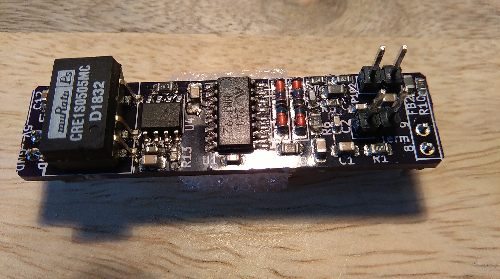
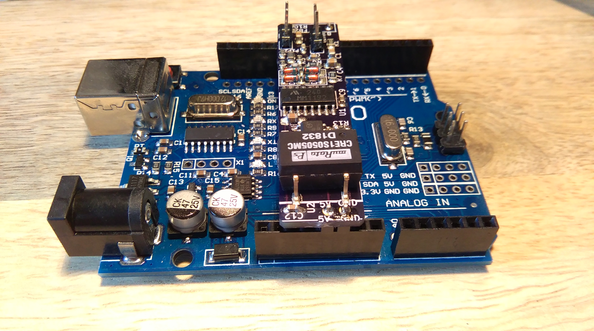
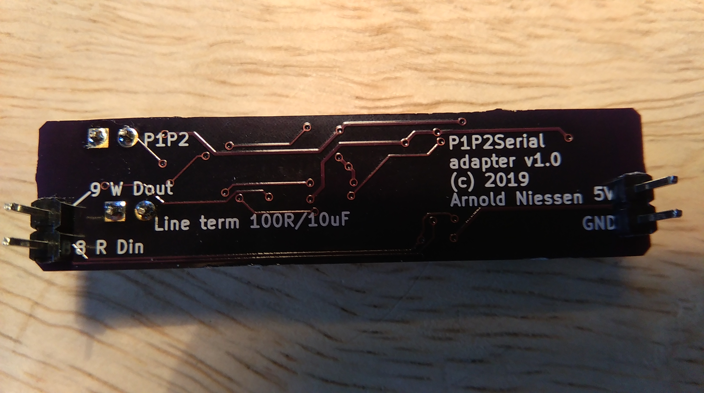

# P1P2-ESP-interface v1.1

The P1P2-ESP-interface is stand-alone and powered by the P1/P2 bus. Ethernet is an optional extension.

# P1P2-ESP-interface v1.0

# P1P2-adapter as Arduino Uno HAT

This HAT adapter for an Arduino Uno uses a MM1192 or XL1192 wit a Si8621 galvanic isolator and a 5V/5V DC/DC converter to enable reading and wrting from/to the P1/P2 bus or other HBS based systems.

It can not be used on an Arduino Mega2560 directly, but it can be used with some wiring.

## Schematics

[Schematics as PDF](Daikin_P1P2_Uno_version2.pdf)

## Pictures of Arduino Uno HAT adapter

