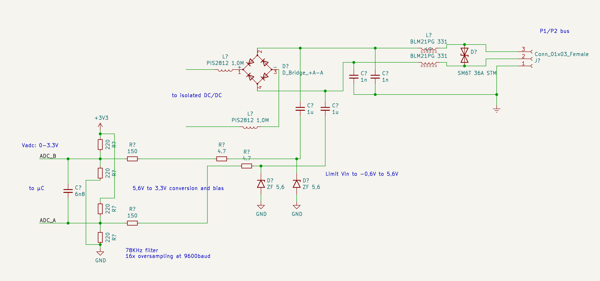
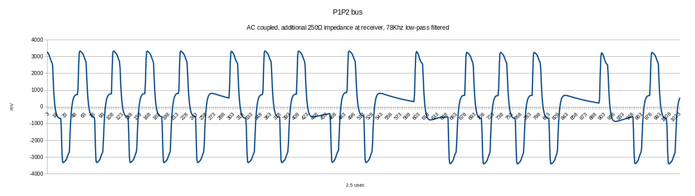

# Daikin P1/P2 bus physical layer

The P1/P2 bus is based on the HBS standard.
It's a low speed, half-duplex, two-wire power line communicaton (PLC) protocol.

By using a simple receiver circuit  the
captured Daikin P1/P2 bus looks like this on the microcontroller side:

**Analysis:**
- The transmitter seem to modulate a +/- 3.3V signal onto the bus
- Every packet transmitted has a DC offset of 0.
- Due to the DC blocking capacitor and the load on the line the signal is no
  longer rectangular.
- Due to DC blocking the "idle" level overshoots/undershoots to +- 700mV.
- The overshoot/undershoot need 4 symbols to settle at 0V again.
