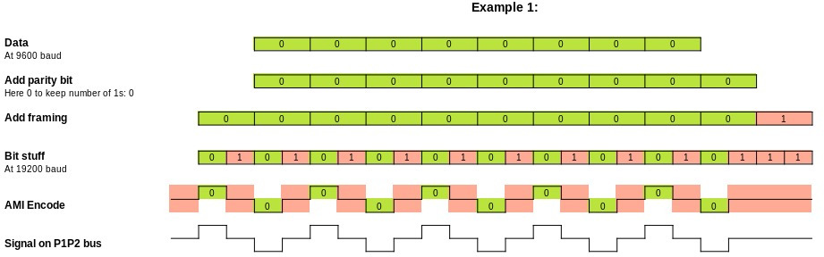

# Daikin P1/P2 bus physical layer

The P1/P2 bus is based on the Japanese the Home Bus System (ET-2101), which is a low speed, half-duplex,
two-wire power line communicaton (PLC) protocol. HBS uses the same physical layer as
[Echonet](https://echonet.jp/wp/wp-content/uploads/pdf/General/Standard/Echonet/Version_2_11_en/spec_v211e_3.pdf).
Some technical details of this standard can be found in chapter 4.

It is a variation of bipolar encoding ([alternate mark inversion](https://en.wikipedia.org/wiki/Bipolar_encoding)), but the pulses only take half of the bit time. So every falling edge in the signal represents a 0, and every "missing" falling edge represents a 1. Every byte is coded as a start bit (0), 8 data bits (LSB first), 1 parity bit (even), and 1 stop bit (1). The Daikin devices have no pause between the stop bit and the next start bit, but Zennio's KLIC-DA has a short pause in between the individual bytes of a packet. The HBS standard has an advanced collision detection and priority mechanism. In a 2-device set up of a Daikin heat pump and a thermostat, the devices seem to simply alternate turns in writing to the bus, and Daikin does not seem to support bus usage detection and collission avoidance, so take care when writing to the bus to avoid bus collisions.

## Example data encoding

The following examples show how data is encoded on the P1/P2 bus. The even parity bit,
together with the [AMI](https://en.wikipedia.org/wiki/Bipolar_encoding) encoding ensures
that the data signal is DC free.

The byte 0x00 encoding results in 10 pulses, 5 up and 5 down, resulting in a DC free signal.

The byte 0x80 encoding results in 8 pulses, 4 up and 4 down, resulting in a DC free signal.

The byte 0xff encoding results in 2 pulses, 1 up and 1 down, resulting in a DC free signal.

## Voltage level capture
By using a simple receiver circuit  the
captured Daikin P1/P2 bus looks like this on the microcontroller side:

**Analysis:**
- The transmitter seem to modulate a +/- 3.3V signal onto the bus
- Every packet transmitted has a DC offset of 0.
- Due to the DC blocking capacitor and the load on the line the signal is no
  longer rectangular.
- Due to DC blocking the "idle" level overshoots/undershoots to +- 700mV.
- The overshoot/undershoot need 4 symbols to settle at 0V again.
