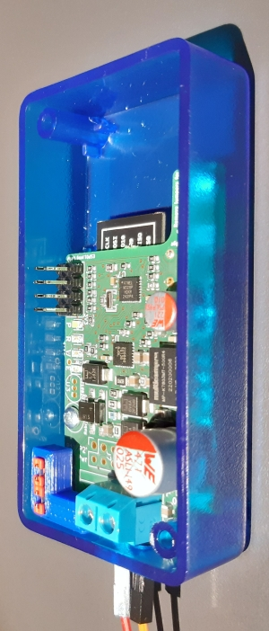
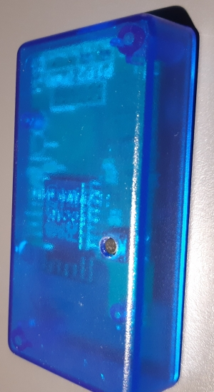

# P1P2MQTT bridge (V1.2)

The P1P2MQTT bridge (V1.2) is stand-alone and powered by the P1/P2 bus. External DC power supply and ethernet are optional.

# MM1192-based Arduino Uno HAT (old)

This HAT adapter for an Arduino Uno uses a MM1192 or XL1192 wit a Si8621 galvanic isolator and a 5V/5V DC/DC converter to enable reading and wrting from/to the P1/P2 bus or other HBS based systems.

It can not be used on an Arduino Mega2560 directly, but it can be used with some wiring.

## Schematics MM1192-based Arduino HAT

[Schematics as PDF](Daikin_P1P2_Uno_version2.pdf)
